# Manual de Usuario - Administrador

## 1. Objetivo

Este documento describe las funcionalidades disponibles para el rol de administrador en el panel del sistema. El administrador puede revisar el estado general de la plataforma y gestionar usuarios, productos, categorias, empresas, inventario y ventas.

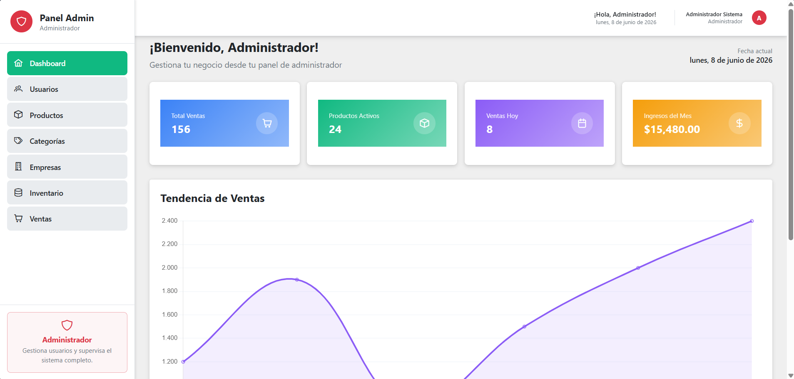

## 2. Acceso al panel

El acceso al panel se valida con la sesion del usuario. Si no existe una sesion activa, el sistema muestra un mensaje de acceso requerido y redirige al inicio de sesion.

Pasos:

1. Inicia sesion con un usuario con permisos de administrador.
2. Ingresa al panel principal desde la opcion de administrador.
3. Verifica que aparezca el menu lateral con todas las opciones del modulo administrativo.

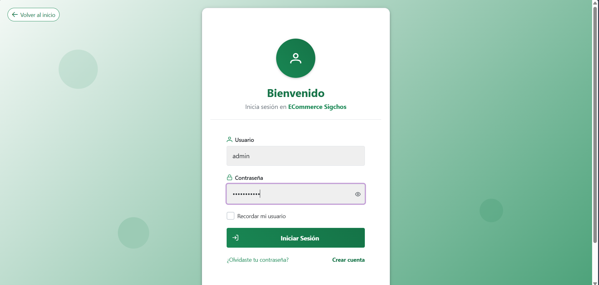

## 3. Estructura general del panel

La interfaz administrativa se compone de tres zonas principales:

1. Menu lateral izquierdo para navegar entre modulos.
2. Barra superior con informacion del panel.
3. Area central donde se muestran tablas, formularios, detalles y acciones.

El menu del administrador incluye estas opciones:

1. Dashboard
2. Usuarios
3. Productos
4. Categorias
5. Empresas
6. Inventario
7. Ventas

## 4. Dashboard

El dashboard presenta una vista general del sistema para que el administrador identifique rapidamente el estado del negocio.

Funcionalidades visibles:

1. Tarjetas resumen con indicadores generales.
2. Grafico de tendencia de ventas.
3. Tabla de ventas recientes.
4. Visualizacion rapida de estados y montos.

Uso sugerido:

1. Abre la opcion Dashboard.
2. Revisa los indicadores principales.
3. Analiza la tendencia de ventas y las operaciones recientes.

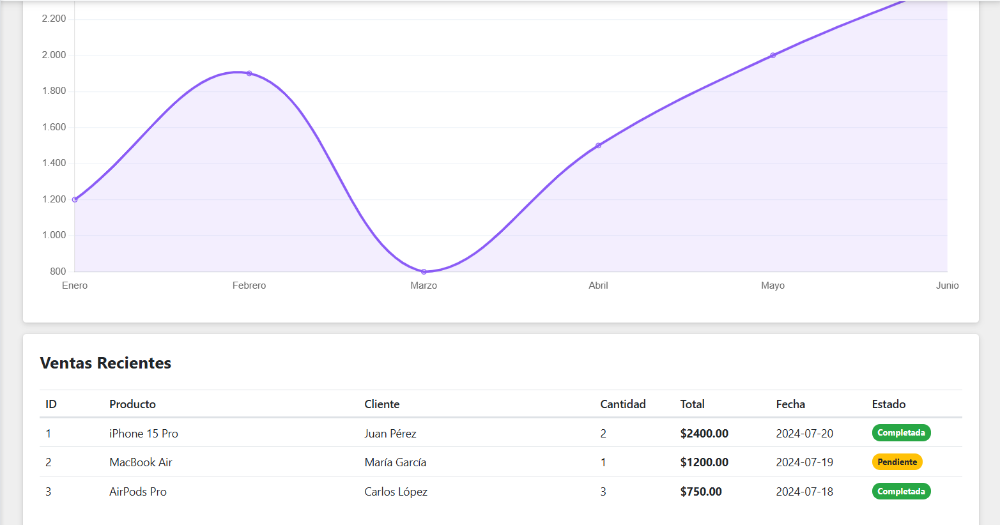

## 5. Gestion de usuarios

En este modulo el administrador puede administrar todas las cuentas del sistema.

Funcionalidades disponibles:

1. Listar usuarios en una tabla con paginacion.
2. Buscar por usuario, nombre, apellido o correo.
3. Filtrar por rol y por estado.
4. Crear usuarios nuevos.
5. Ver detalles completos de un usuario.
6. Editar datos del usuario.
7. Activar o desactivar usuarios.
8. Eliminar usuarios.
9. Seleccionar varios registros en la tabla.

Uso sugerido:

1. Entra a Usuarios.
2. Usa los filtros para localizar una cuenta.
3. Ejecuta la accion deseada desde la columna de acciones.
4. Confirma las operaciones destructivas cuando el sistema lo solicite.

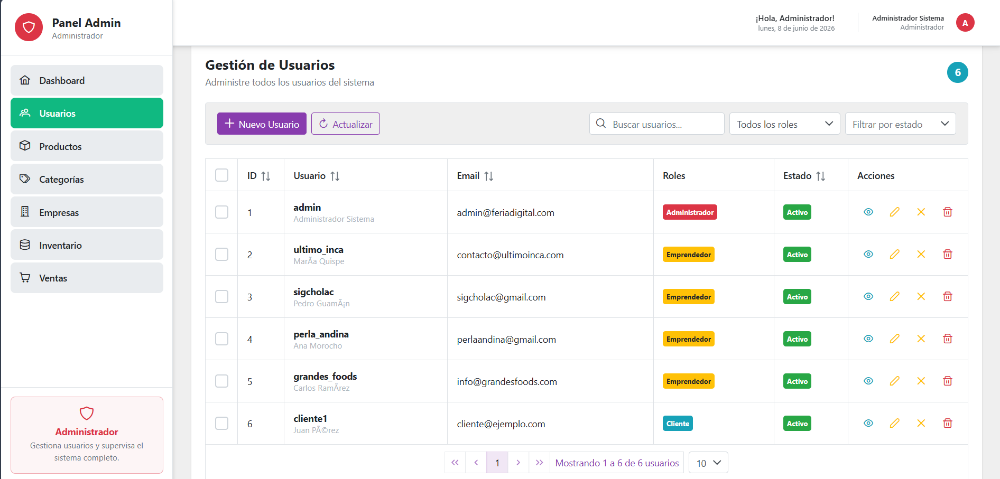
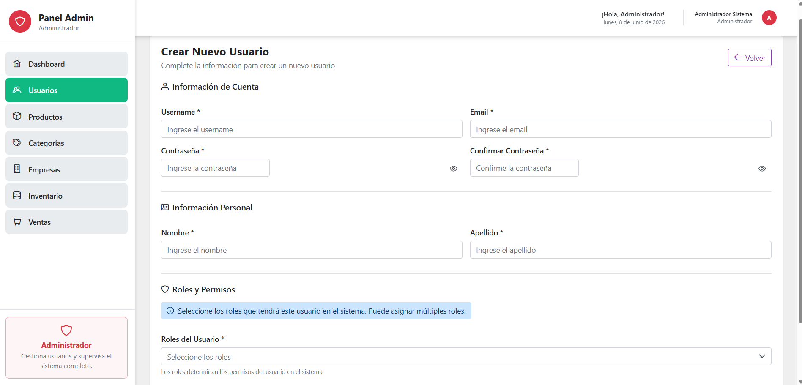
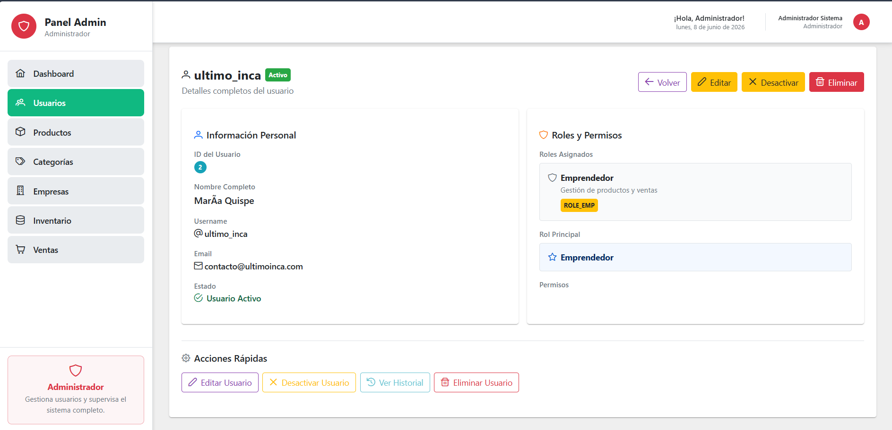
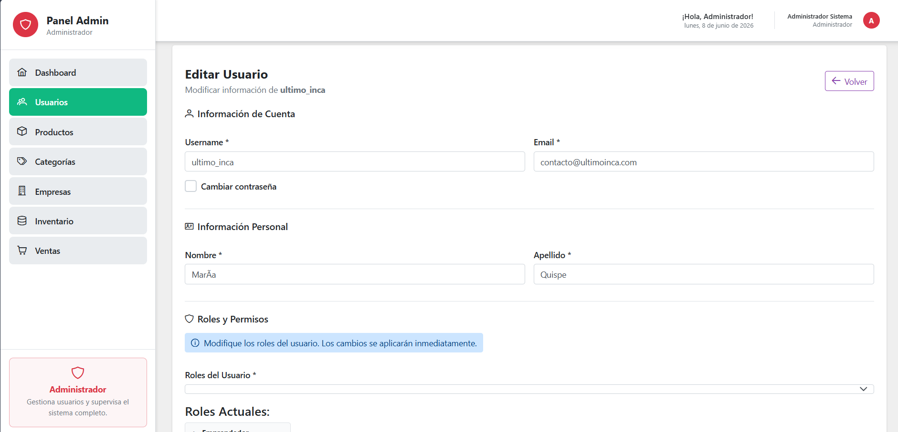

## 6. Gestion de productos

El modulo de productos permite revisar y mantener el catalogo principal del sistema.

Funcionalidades disponibles:

1. Listar productos con imagen, nombre, categoria, empresa, precio, stock y estado.
2. Buscar productos por nombre, descripcion, categoria o empresa.
3. Ver detalles del producto en una ventana modal.
4. Crear productos nuevos.
5. Editar productos existentes.
6. Eliminar productos.
7. Consultar el stock asociado a cada producto.

Uso sugerido:

1. Entra a Productos.
2. Usa el buscador para localizar el articulo.
3. Revisa los detalles o selecciona editar para modificar datos.
4. Verifica el estado y el stock antes de eliminar o desactivar.

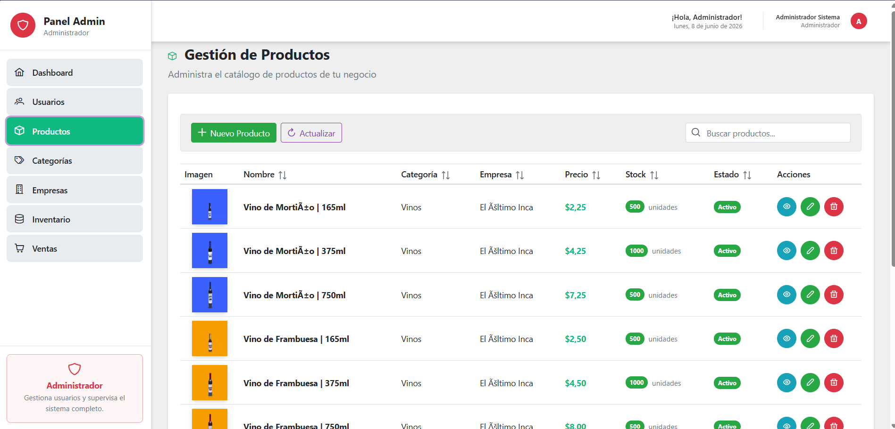
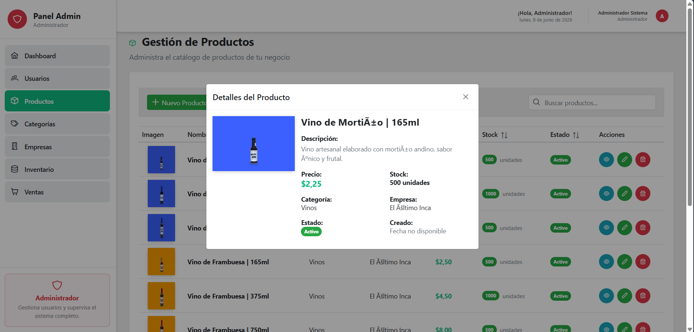
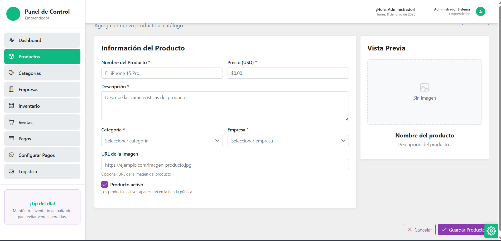

## 7. Gestion de categorias

Este modulo permite organizar el catalogo por categorias.

Funcionalidades disponibles:

1. Listar categorias con paginacion.
2. Buscar por nombre o descripcion.
3. Ver detalles de una categoria.
4. Crear categorias nuevas.
5. Editar categorias existentes.
6. Eliminar categorias.
7. Activar o desactivar categorias.

Uso sugerido:

1. Entra a Categorias.
2. Usa el campo de busqueda para filtrar resultados.
3. Abre el detalle, edita o elimina segun lo necesites.
4. Al crear o editar, verifica que el nombre sea descriptivo.

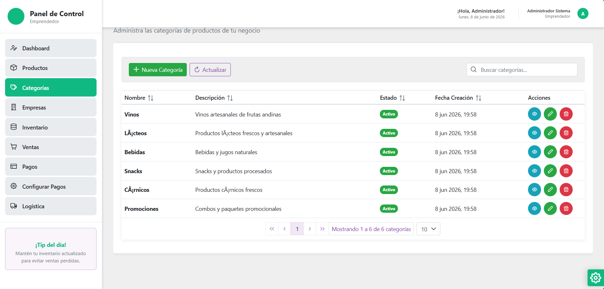
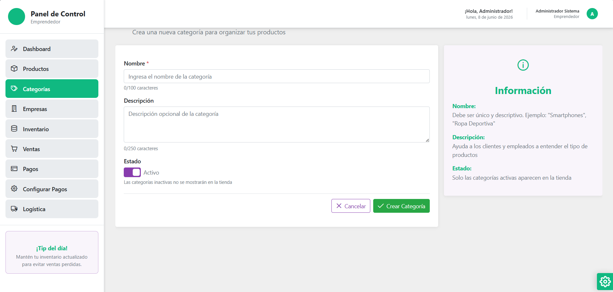
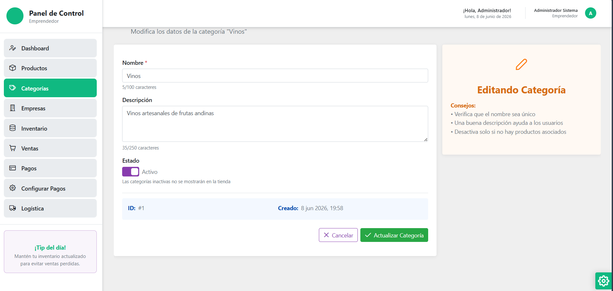

## 8. Gestion de empresas

El modulo de empresas registra y mantiene las empresas proveedoras o asociadas al catalogo.

Funcionalidades disponibles:

1. Listar empresas.
2. Buscar por nombre, RUC, correo, telefono o direccion.
3. Ver detalles de una empresa.
4. Crear empresas nuevas.
5. Editar empresas existentes.
6. Eliminar empresas.
7. Activar o desactivar empresas.

Uso sugerido:

1. Entra a Empresas.
2. Localiza el registro con el buscador.
3. Revisa los datos de contacto antes de editar o eliminar.
4. Registra nuevas empresas con informacion completa y valida.

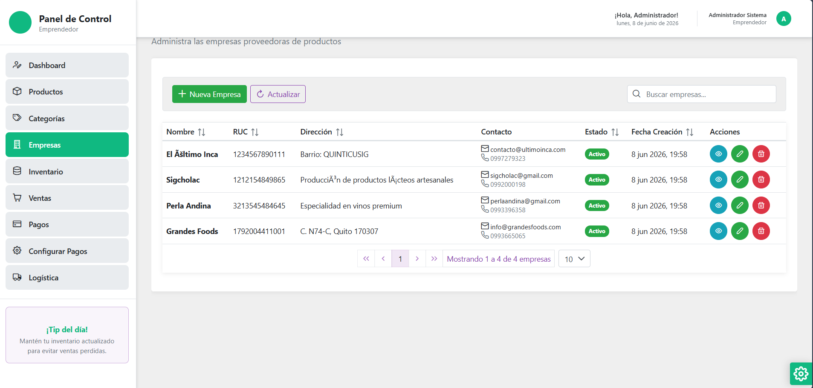
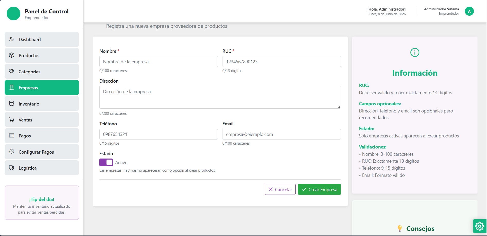
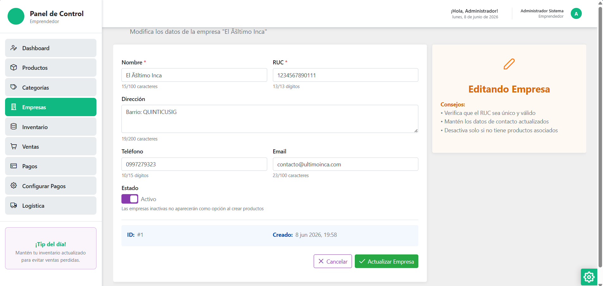

## 9. Gestion de inventario

Este modulo controla el stock, los movimientos y los ajustes de inventario.

Funcionalidades disponibles:

1. Ver inventarios en una tabla.
2. Revisar el historial de movimientos.
3. Crear un nuevo registro de inventario.
4. Ajustar stock de manera individual.
5. Realizar ajustes masivos sobre varios productos.
6. Cambiar ubicacion del inventario.
7. Consultar alertas o cambios de stock.

Uso sugerido:

1. Entra a Inventario.
2. Revisa primero la pestaña de inventarios.
3. Usa la pestaña de movimientos para auditar cambios.
4. Crea o ajusta stock cuando sea necesario y confirma los cambios.

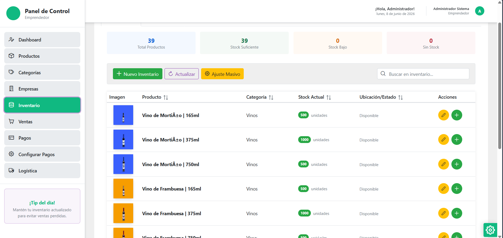
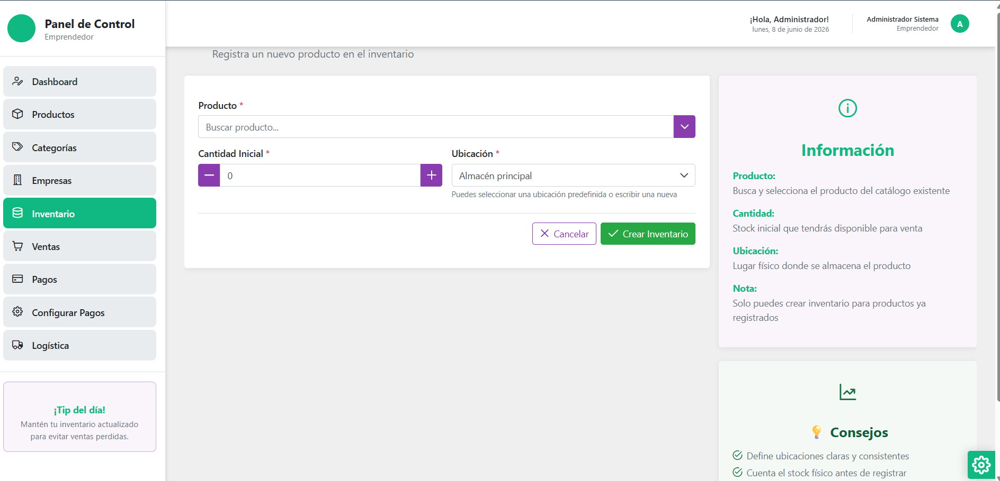
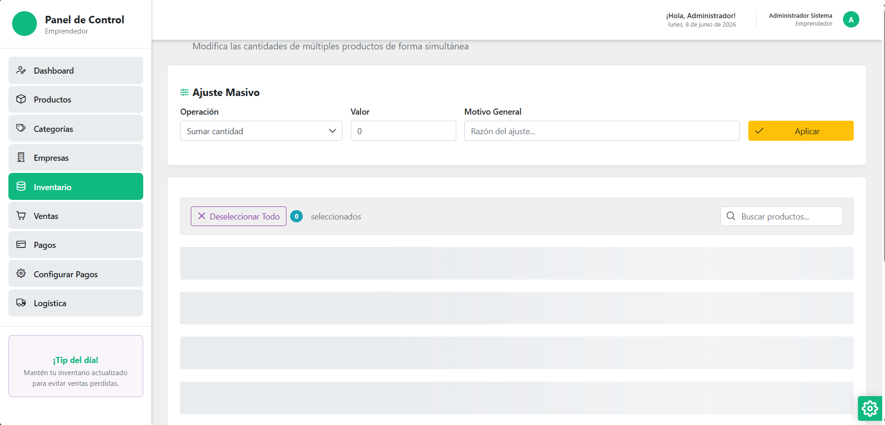
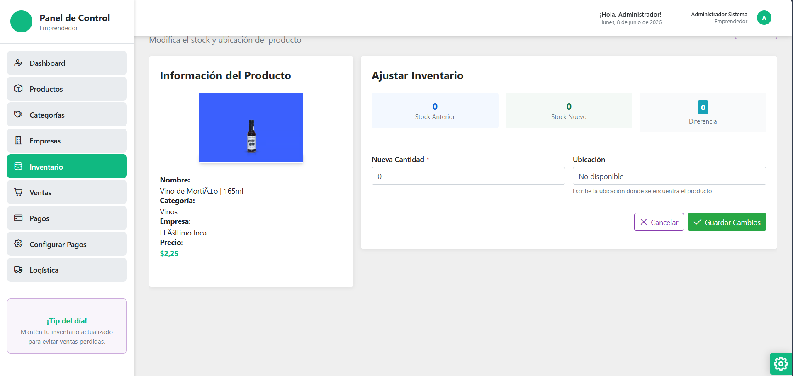

## 11. Buenas practicas de uso

1. Revisa el dashboard al iniciar sesion para tener una vision general.
2. Verifica dos veces antes de eliminar usuarios, productos, categorias o empresas.
3. Mantiene actualizado el inventario para evitar diferencias de stock.
4. Usa los detalles de ventas para validar estados antes de completar o cancelar.
5. Cierra sesion al terminar si compartes el equipo.

## 12. Resumen rapido de funciones

1. Supervisar el sistema desde el dashboard.
2. Administrar usuarios con altas, edicion, activacion y eliminacion.
3. Mantener el catalogo de productos.
4. Organizar categorias y empresas.
5. Controlar inventario y movimientos de stock.
6. Monitorear y gestionar ventas.
